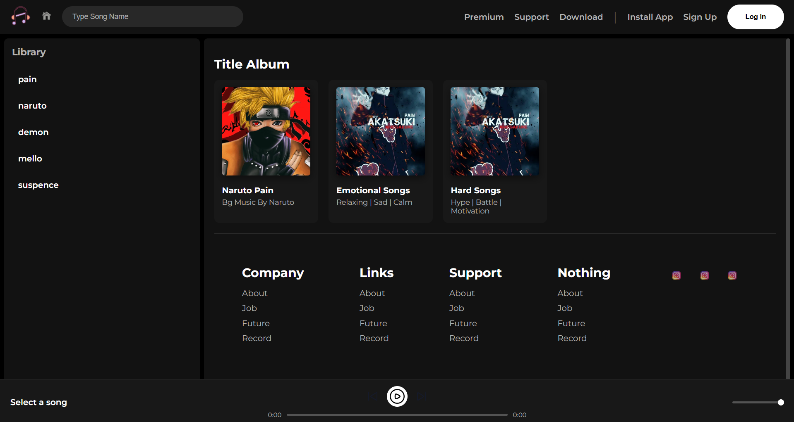

# 🎵 Modern Music Player

A sleek and responsive web-based music player built with vanilla **HTML**, **CSS**, and **JavaScript**.  
This project provides a clean, modern interface for browsing and playing music from different playlists, complete with custom audio controls.

---

## 📸 Preview



---

## ✨ Features
- **Dynamic Music Library**: Automatically populates the music library from predefined playlists in the JavaScript code.  
- **Playlist Categories**: Displays songs organized into different albums or categories (e.g., Emotional, Hard).  
- **Interactive Song List**: Click on any song in the library to play it instantly.  
- **Now Playing Indicator**: The currently playing song is highlighted in the library.  
- **Custom Audio Controls**:
  - Play / Pause, Next, and Previous track controls  
  - Custom seek bar to scrub through the track  
  - Real-time display of the current time and total duration  
  - Volume slider for precise audio control  
- **Modern & Responsive UI**: Clean, dark-themed interface with hover effects and smooth transitions.  
- **Easy to Customize**: Add your own songs by updating the `playlists` object in `code.js`.

---

## 💻 Tech Stack
This project is built using core web technologies without external frameworks:

- **HTML5** → Structure and layout  
- **CSS3** → Styling, dark theme, responsive layout, animations  
- **JavaScript (ES6)** → Audio playback, DOM manipulation, user interactions  

---

## 🚀 Getting Started

### Prerequisites
You only need a modern web browser that supports **HTML5, CSS3, and JavaScript**.

### Installation
Clone the repository to your local machine:

```bash
git clone https://github.com/Ryker009/Music-Player.git
